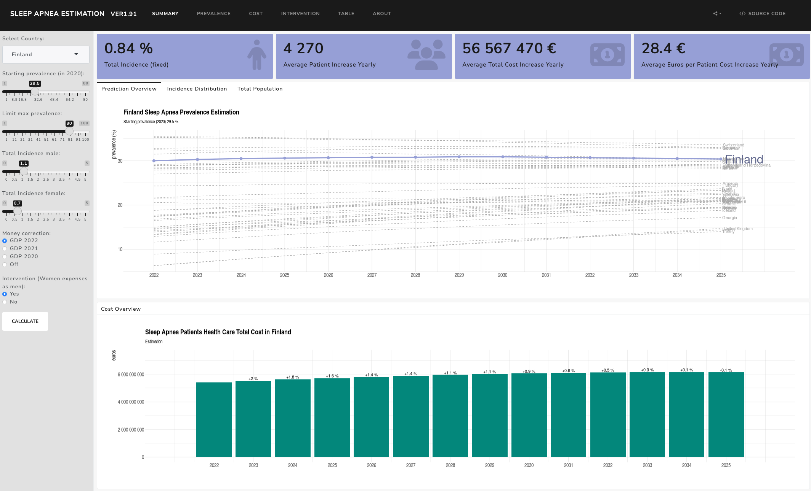
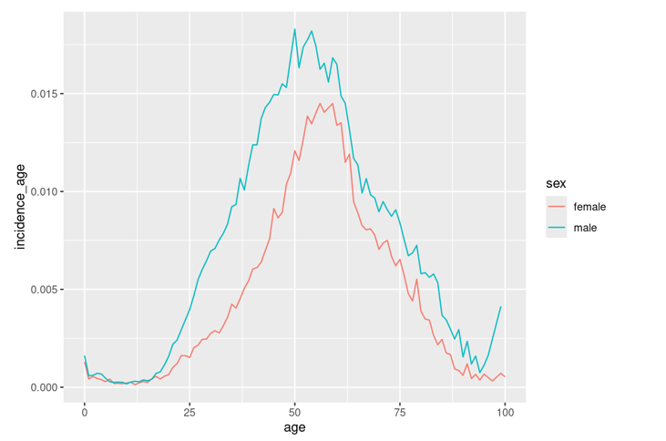

# Sleep Apnea Estimation


Application simulates Sleep Apnea prevalences and costs to selected country. Available Countries:
*Albania, Armenia, Austria, Azerbaijan, Belarus, Belgium, Bosnia and Herzegovina, Bulgaria, Croatia, Cyprus, Denmark, Estonia, Finland, France, Georgia, Germany, Greece, Hungary, Iceland, Ireland, Italy, Kazakhstan, Latvia, Lithuania, Luxembourg, Malta, Montenegro, Netherlands, Norway, Poland, Portugal, Romania, Serbia, Slovakia, Slovenia, Spain, Sweden, Switzerland, Turkey, Ukraine, United Kingdom*

- Image Available at docker hub: <https://hub.docker.com/repository/docker/janikmiet/sleeprevolution_prediction/general>




# Installation / Launch

## Terminal App Run

```
R -e "shiny::runApp('app/')"
```


## Docker Image

Use docker to launch app

```
docker build  --no-cache -t sleep22prediction . 
docker run --name shiny_sleep22prediction --rm -d -p 3838:3838 sleep22prediction
```

## ShinyServer / rsconnect

Modify and use script `deploy.R`


# Notes

1. Install libraries 

Check the `install_packages.R` script for necessary packages needed.


2. Baseline data

In the application folder there is `global.R` script which has a function, which creates osa predictions. This function creates the data for the prediction baseline. Feel free to inspect the function more.

```
source("./app/global.R")
create_osapred(WRITE_DATA = TRUE)
```


# METHOD USED

Simulation is done by using statistical weights which are calculated from Finnish registry dataset. In Finnish registry dataset we have a full population of people who have got diagnosed sleep apnea by age and gender. In short, we use these distributions to weight to other countries populations to estimate sleep apnea patients.

## ASSUMPTIONS

1. On simulation starting year (2020) we used [Benjafield et al. (2019)](https://pubmed.ncbi.nlm.nih.gov/31300334/) estimated sleep apnea prevalences.
2. Incidence distribution by age and sex is assumed to be fixed over the years. Also the incidence distribution is assumed behave similar than in Finland, but total incidence can vary due to population age distribution.
3. Health Care costs are similar in all countries

For these assumptions application has options to fine tune estimation:

1. Starting prevalence can be changed
2. Incidence distribution can be changed by total incidence by male and female patients
3. Costs can be optionally fixed by GDP ratio


## Incidences

We calculated incidence age and sex distribution in 2022 from Finnish registry dataset which we used as a base distribution for incidences.  We noticed that incidence distribution for earlier years seems to be similar, but only total incidence changes. Incidence distribution is proportioned to population size by age and sex.




### Prevalences

[Benjafield et al. (2019)](https://pubmed.ncbi.nlm.nih.gov/31300334/) estimated sleep apnea prevalence for countries in 2019. Here we used only with moderate or severe prevalent cases to simulate sleep apnea patients.

### COSTS

Presented cost are total health care cost and not specifically sleep apnea costs. Costs are calculated from Finnish registy from sleep apnea patients who have visited hospital.

### Simulation

First we calculate baseline data for countries. Age grouped population are expanded to one year populations by using weights what we derived from Finnish population dataset. Using population dataset and Benjafield prevalence we can get total amount of prevalent patients. Prevalent cases are then expanded to incidence cases, 1 year diagnosed, 2 year diagnosed and rest of the prevalent cases groups. These prevalent cases ratios we derived from Finnish registry dataset.

After baseline data is created we run simulation loop, where we add new patients by incidence ratios and move prevalent cases to the next year according to their group. Prevalent cases are deducted by death rates each year (expect the incidence cases).

Sleep Apnea cost distribution is calculated from Finnish registry dataset. From the registry data, we calculated average costs by sex, age and how many years person have had sleep apnea.


## DATAS AND SOURCES

| Dataset    | Description | Source |
| ---------- | ----------- | ------ |
| populations.parquet  | Population by country, sex and age group. Timeline 2020-2100.| https://ghdx.healthdata.org/ihme_data |
| gdp.parquet | GDP ratios by countries fixed to Finland.  | https://data.worldbank.org/ |
| ratio_xxx.parquet    | Ratios calculated from Finnish registry.  | Hilmo, IMPRO |
| cost_osa.parquet | Sleep apnea mean costs | Finnish registry data |
| osa_benjafield.parquet | Sleep apnea estimated prevalence in 2019 | [Benjafield et al. (2019)](https://pubmed.ncbi.nlm.nih.gov/31300334/) |
| WHO_drates.parquet | Death Rates by countries | [World Health Organization](https://www.who.int/data/data-collection-tools/who-mortality-database) |
| ratio_inc_to_1v2v.parquet | Ratios to calculate 1 and 2 year patients from the incidence cases | Finnish registry data |
| ratio_incidence_avg.parquet | Incidence distributions | Finnish registry data |
| ratio_pop_agegroup_to_age.parquet | Ratios to expand age groups to 1 year group | Finnish registry data |
| ratio_prev_to_wide.parquet | Ratio to expand prevalent cases to incident, 1 year and 2 year diagnosed cases | Finnish registry data |
| ratio_prev_total_to_age.parquet | Ratios to get age distributed prevalent cases from total prevalence | Finnish registry data |


## APPLICATION

Function `create_osapred()` creates full simulation dataset called `osasimulation.parquet` from the input datasets. Application simply reuses the function and visualizes the results.

- Starting prevalence is initally fixed as how Benjafield and et al. estimated prevalence to by specific country in 2019. 

- Prevalence can be limited, so that it want go higher on age & sex groups by giving it a value.

- Incidences are initally fixed how countries population would give total incidence by sex by using the Finnish registry 2022 incidence distribution. Total incidence by sex can be changed by using the sliders.

Initially cost for all countries are calculated by pre-adjusted fixed settings (countries prevalence is shown in grey in first plot). Applications shows data only of the timeline after the simulation calibration period (2 years). If you wish to make predictions other year, download the project files and use `create_osapred()` function to access the full data.


### Overview

This tab shows prevalence, incidence and population change in time period. Total cost are estimated and shows what is percentage difference compared to previous year.

- Total Incidence: total incidence (new patients) percentage of the incidence distribution

- Average Patient Increase Yearly: how the sleep apnea population changes between years. Incidence cases are added and sleep apnea population is decreased by death rates yearly.

- Average Total Cost Increase Yearly: mean change of the total cost per year

- Average Euros per Patient Cost Increase Yearly: How much cost average change during the timeline. Population age distribution and new patients affects to this.

### Prevalence

This tab shows detailed information of prevalence estimation by sex and age groups.

### Costs

This tab shows total health care cost of sleep apnea patients by sex and age groups.

### Intervention

Tab shows effect of intervention on costs.

- Effect Index: shows index value of how effective intervention is cost wise. If value is 1, there is no effect. When value rises, intervention is more effective. Calculated what is difference of the total cost on time period.

- Total Cost: how much is the cumulative total cost difference on time period.

- Mean Difference Cost per Patient: how much is the difference on cost per patient in time period.

## DISCLAIMER

These estimation are done by few assumptions using datasets which were available. Results are developed so that they are informative and opens up conversations. Estimations are not meant to be used as is. We cannot guarantee the righteous of the results.


## ACKNOWLEDGEMENT  

Special thanks for all of the people from the working group and persons who gave feedback on developing the application. Especially Anna But and Reijo Sund.


